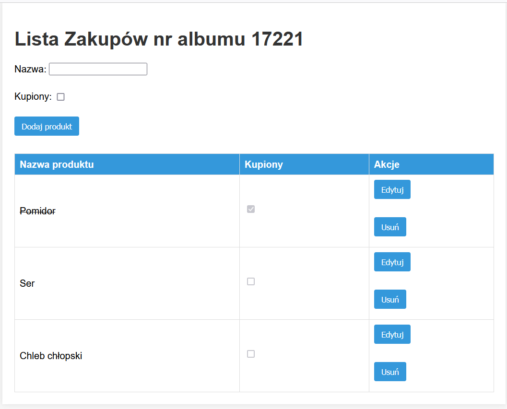
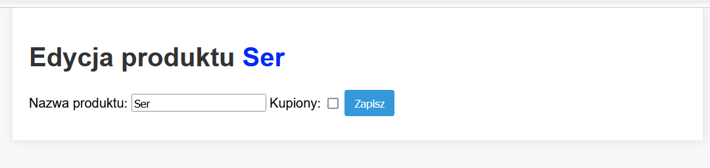

<H1>SHOPPING_LIST</h1>

Celem zadania było przygotowanie aplikacji MVC przedstawiającej listę zakupów​

Aplikacja powinna mieć możliwość:​

 - Wyświetlenie listy zakupów​

 - Dodanie produktu listy​

 - Edycji produktu – dodanie mechanizmu, checkboxa (kupiono, nie kupiono)​

 - Usunięcie produktu z listy​

 - Dane powinny być zapisane w bazie danych​

Zadanie zrealizowano przy pomocy Django. Użyta baza danych sqlite3 (wbudowana w framework Django)

Widok listy zakupów

Ekran edycji
