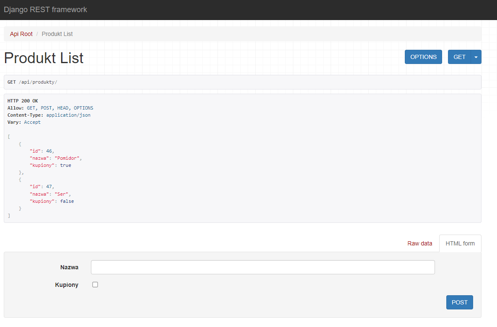
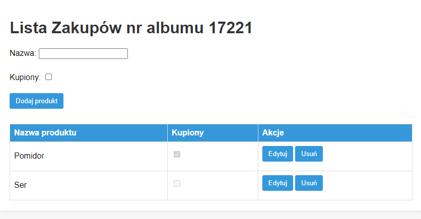

<H1>Zjazd 3</h1>
<H1>SHOPPING_LIST</h1>

Celem zadania było przekształcenie aplikacji z zadania 2 tak aby:​

Aplikacja powinna mieć możliwość:​

 - Logike biznesową (CRUD) miała wystawiona w formie REST API​

 - UI i frontend jako osobna aplikacja typu Single Page Application (React, Angular, Vue, JQuery)​

 - Wywołania  przez API używajac bibliotek typu fetch, axios lub podobnych.​

Zadanie zrealizowano przy pomocy Django REST framework, który umożliwia wystawianie REST API

przykładowe zapytania do API:
curl http://{IP}/api/produkty/ -> zwraca listę produktów

curl http://{IP}/api/produkty/{ID} -> zwraca konkretny produkt

curl -X DELETE http://{IP}/api/produkty/{ID} -> usuwa produkt o danym ID

curl -d "nazwa=nowa nazwa&kupiony=true" -X PUT http://{IP}/api/produkty/{ID} -> modyfikuje produkt o danym ID

Ekran edycji produktu został przeniesiony na tę samą stronę co lista produktów i jest wywoływany przy pomocy "edytuj" (JQuery)

Do interakcji z API użyto fetch

Kliknięcia przycisków generują wywołania API w celu wywołania konkretnej akcji. Miałem dylemat czy listę generować na podstawie danych zaciąganych z modelu, czy na podstawie danych otrzymanych poprzez zapytanie do API o listę produktów. Jednak w tym przypadku zastosowano drugą opcję.