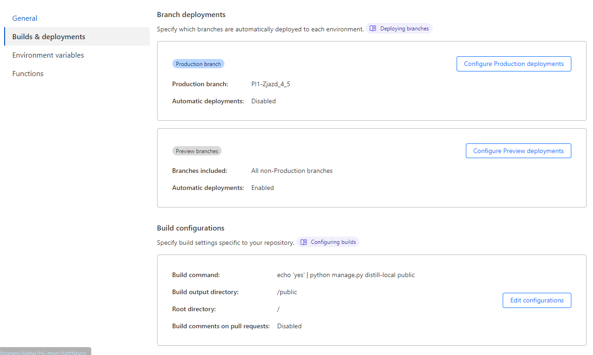
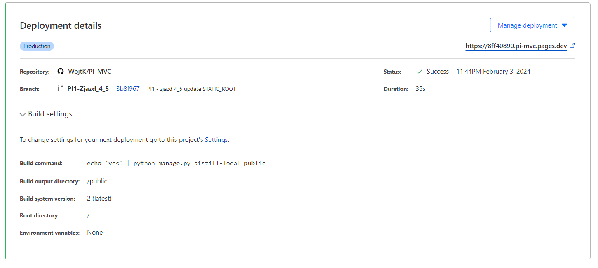
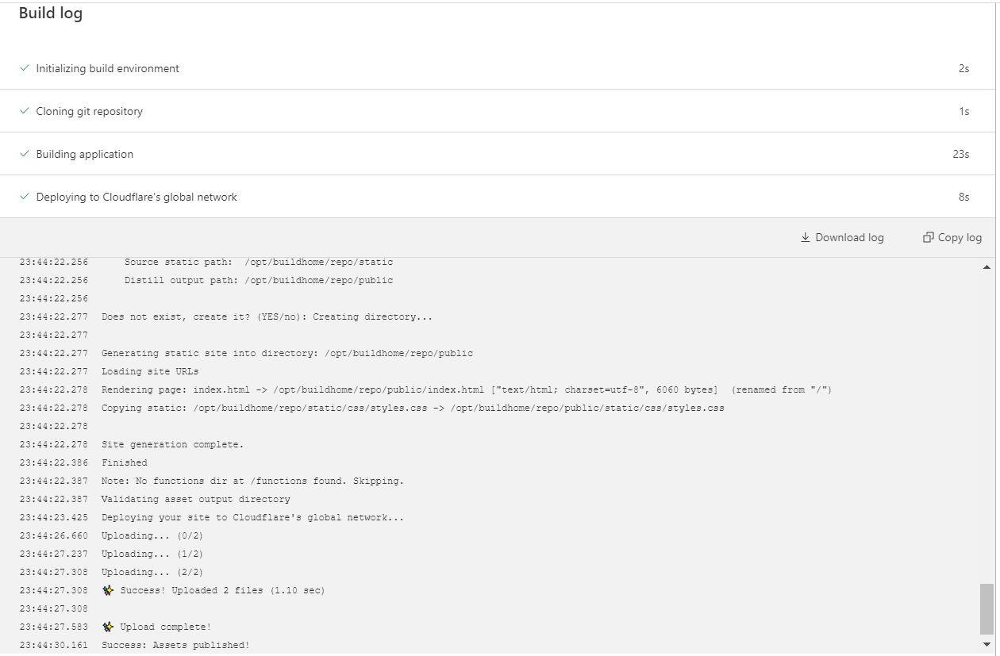
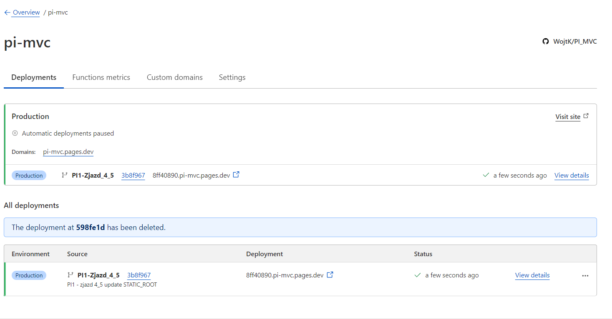
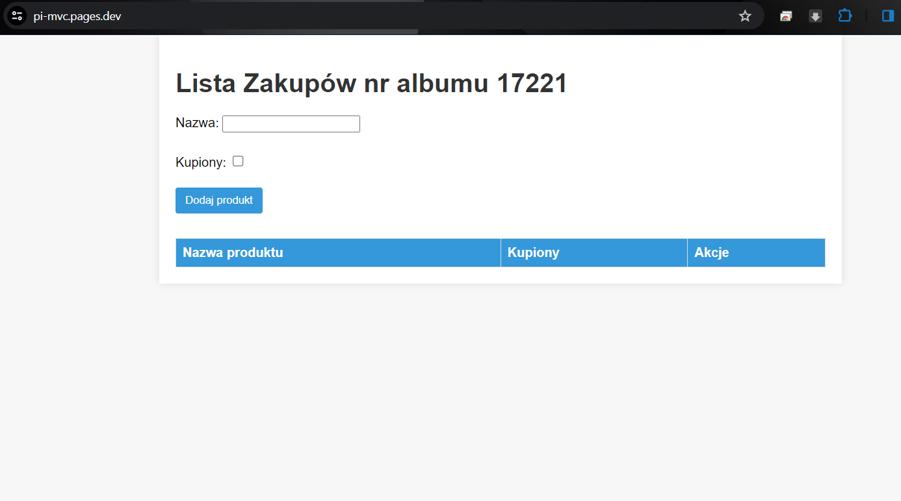
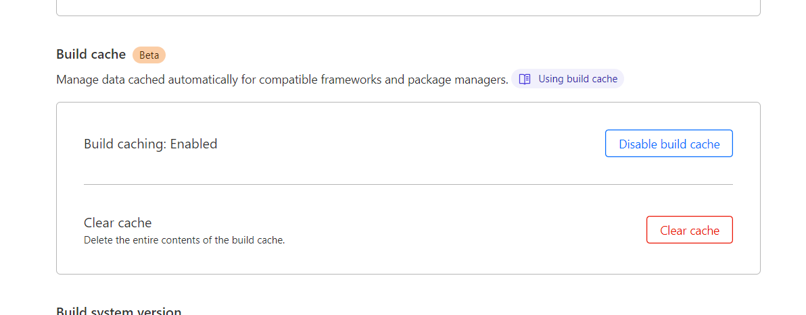
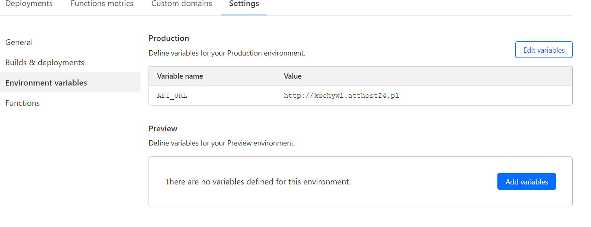

<H1>Zjazd 4 i 5</h1>
<H1>SHOPPING_LIST</h1>

Należy przekształcić aplikacje napisaną w zadaniu 2 tak aby można było ją uruchomić na cloudflare workers:​

W ramach zadania udało się zdeployować na cloudflare statyczną stronę (widok) aplikacji. Bez backendu zrobionego w Django, nie udało mi się wrzucić.

Zmiany w kodzie aplikacji:
 - instalacja django-distill
 - dostosowanie adresów url pod django-distill

Przy pomocy django-distill i polecenia "echo yes | python manage.py distill-local public" generują się statyczne elementy aplikacji

Repozytorium cloudflare zostało spięte z githubem. Opcja deploy przy każdym pushu do brancha została wyłączona.

Strona:

Cache:

Zmienna środowiskowa (link do API backendu na innej stronie, na której udało postawić się aplikację Django):

